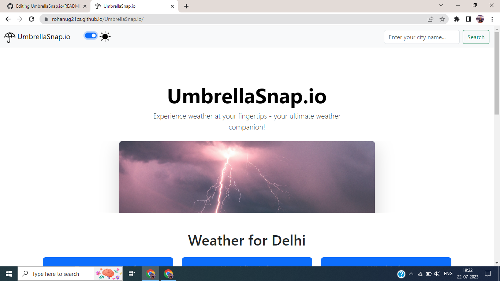
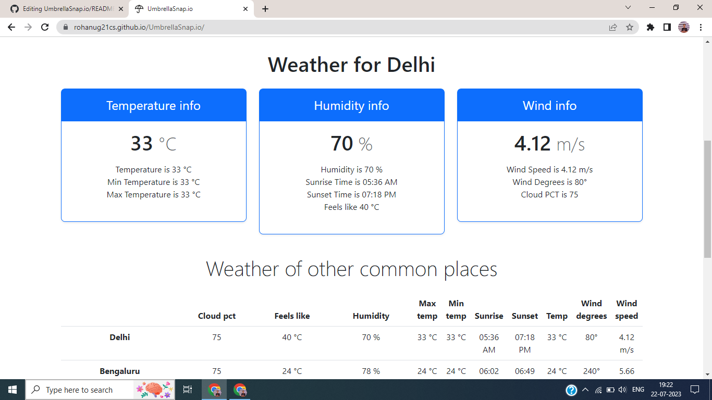

# UmbrellaSnap.io
<h4>Site is Live here:</h4>
<a href="https://rohanug21cs.github.io/UmbrellaSnap.io/">Click Here</a>
<h2>Real-Time Weather App</h2>
The Real-Time Weather App is a web application that allows users to get real-time weather reports by entering their city name. Built with HTML, Bootstrap, and JavaScript, this app provides a user-friendly interface and dynamically displays weather details for famous cities at the bottom of the page.
<h2>Introduction</h2>
The Real-Time Weather App is a simple and efficient way to check real-time weather conditions for any city around the world. It leverages various web technologies such as HTML, Bootstrap, and JavaScript to create a smooth and interactive user experience.
<h2>Features</h2>
<ol>
  <li> <strong> Real-Time Weather Report</strong>: Users can enter the name of their city in the provided input field and get an instant weather report.</li>
  <li> <strong> List of Famous Cities</strong> : The app showcases a list of famous cities with dynamically updated weather details. Users can quickly access weather information for these cities without having to search.</li>
  <li> <strong> Light Mode and Dark Mode</strong>: The app offers a light mode by default, but users can easily switch to dark mode for a more comfortable viewing experience, especially in low-light environments.</li>
</ol>
<h2>Screenshots</h2>
<h3>Light Mode</h3>

<h3> Dark Mode</h3>

<h2>Usage</h2>
<ol>
  <li>
    Open the Real-Time Weather App in your web browser.
  </li>
  <li>Enter the name of your city in the input field and press Enter or click the "Search" button.</li>
  <li>The weather report for the entered city will be displayed on the screen.</li>
  <li>Scroll down to the bottom of the page to find a list of famous cities and their weather details.</li>
</ol>
<h2>Switching between Light Mode and Dark Mode</h2>
To switch between light mode and dark mode:
<ol>
  <li>Locate the "Toggle Dark Mode" button in the nav-bar of the app.</li>
<li>Click the button to toggle between light mode and dark mode.</li>
<li>The app's theme will change accordingly to match your preference.</li>
</ol>
<h2>Contributing</h2>
Contributions to the Real-Time Weather App are welcome! If you find any issues or have suggestions for improvements, please feel free to create a pull request. For major changes, please open an issue first to discuss the proposed changes.
 
 
 
We hope you find the Real-Time Weather App helpful and easy to use! If you encounter any problems or have any questions, please don't hesitate to reach out by opening an issue on this GitHub repository. Enjoy checking the weather in real-time!
